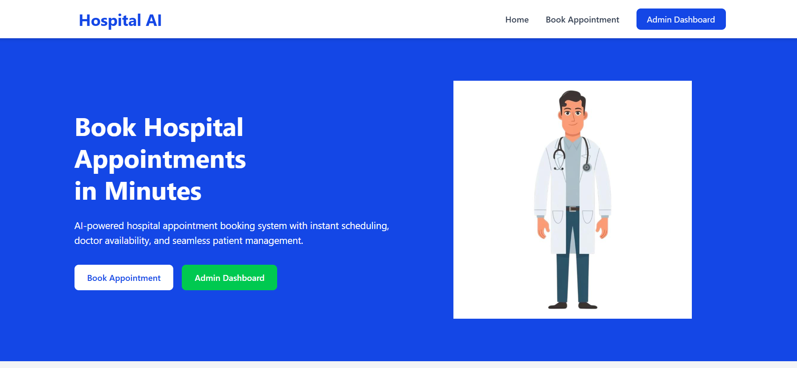
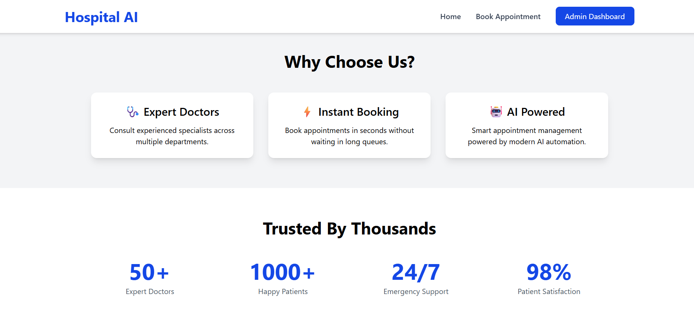
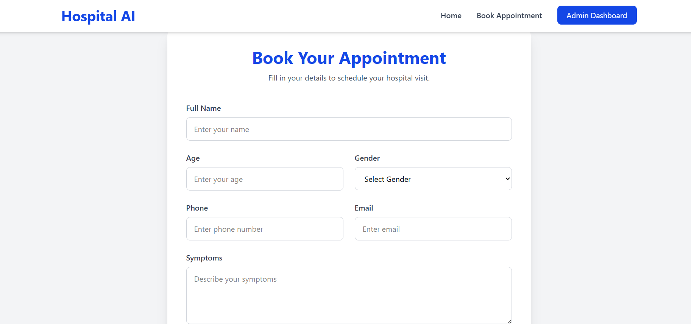
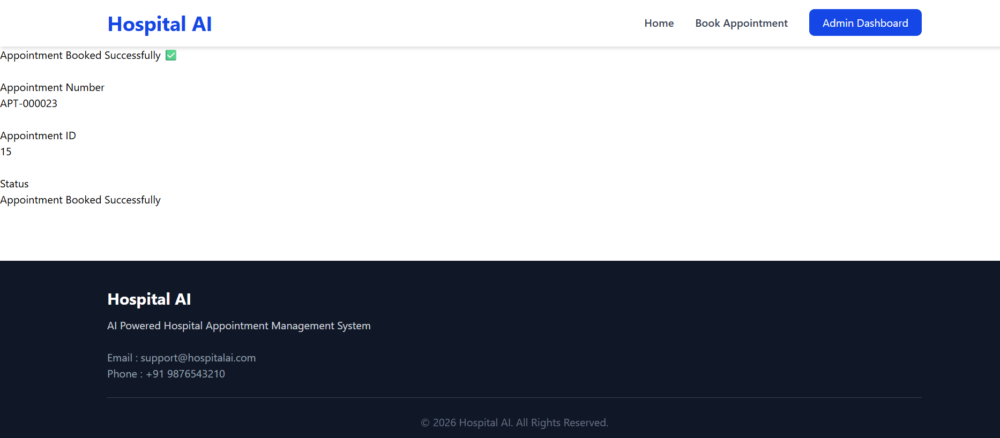
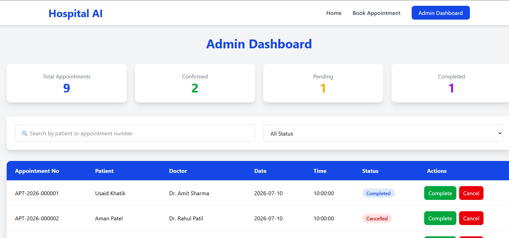

# 🏥 Hospital Appointment Management System

A modern Full Stack Hospital Appointment Management System that allows patients to book appointments online while providing administrators with a professional dashboard to manage appointments.

---

## 📌 Project Overview

This application digitizes the hospital appointment process by allowing patients to:

- Book appointments online
- Select doctors
- Choose available time slots
- Receive appointment confirmation

Administrators can:

- View all appointments
- Search appointments
- Filter by status
- Update appointment status
- Monitor appointment statistics

---

## ✨ Features

### 👨‍⚕️ Patient Module

- Responsive Home Page
- Professional Landing Page
- Appointment Booking Form
- Doctor Selection
- Available Time Slot Selection
- Form Validation
- Appointment Confirmation

### 👨‍💼 Admin Module

- Dashboard Overview
- Appointment Statistics
- Search Appointments
- Filter by Status
- Update Appointment Status
- Responsive Table
- Status Badges
- Confirmation Dialogs

---

## 🛠️ Tech Stack

### Frontend

- React.js
- Vite
- Tailwind CSS
- React Router
- Axios

### Backend

- FastAPI
- Python

### Database

- MySQL

### Version Control

- Git
- GitHub

---

## 📂 Project Structure

```
Hospital_Appointment_System/

├── hospital-frontend/
│   ├── src/
│   │   ├── assets/
│   │   ├── components/
│   │   ├── pages/
│   │   ├── services/
│   │   ├── App.jsx
│   │   └── main.jsx
│   └── package.json
│
├── hospital-backend/
│   ├── main.py
│   ├── database.py
│   ├── models.py
│   ├── routes/
│   └── requirements.txt
│
└── README.md
```

---

## 📸 Screenshots

### 🏠 Home Page

Professional landing page with hospital information and quick appointment booking.



---

### 📅 Book Appointment

An intuitive, step-by-step scheduling interface where patients can select medical specialties, choose preferred doctors, and view real-time calendar availability.



---

### ✅ Appointment Success

Confirmation page providing the final booking status, tracking numbers, and official appointment confirmation details.



---

### 📊 Admin Dashboard

A comprehensive management hub for hospital staff to track daily appointments, manage doctor schedules, view patient analytics, and update hospital capacity metrics at a glance.



---

## 🚀 Installation

### Clone Repository

```bash
git clone https://github.com/yourusername/hospital-appointment-system.git
```

---

### Frontend

```bash
cd hospital-frontend
npm install
npm run dev
```

---

### Backend

```bash
cd hospital-backend

python -m venv venv

venv\Scripts\activate

pip install -r requirements.txt

uvicorn main:app --reload
```

---

### Database

- Install MySQL
- Create the required database
- Import the SQL schema
- Update database credentials

---

## 📈 Future Improvements

- AI Symptom Analysis
- AI Doctor Recommendation
- AI Chatbot
- Email Notifications
- WhatsApp Notifications
- Appointment Reminders
- Payment Gateway
- Medical Report Upload

---

## 👨‍💻 Author

**Usaid Aarif Khatik**

Computer Engineering Graduate

AI Engineer Enthusiast

